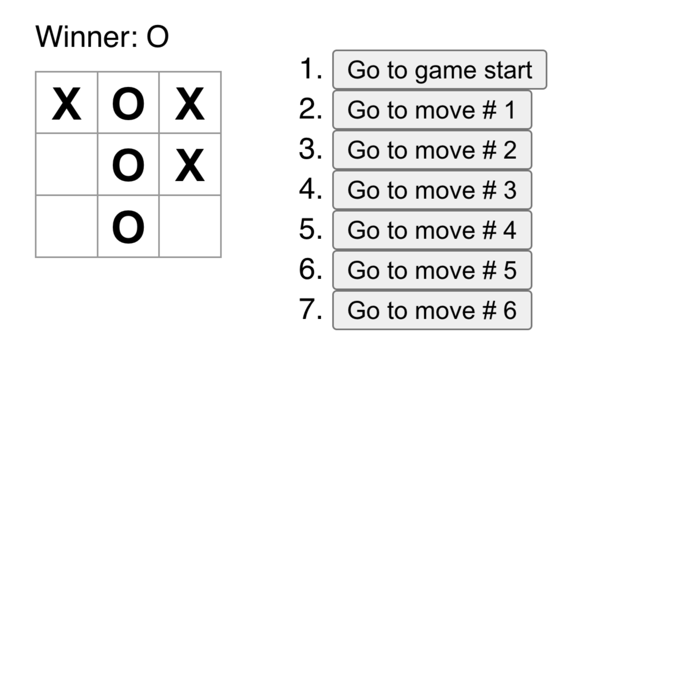

<br/>
<p align="center">
  <a href="https://github.com/glenmiracle18/Tic-tac-toe-react- ">
  </a>

  <h1 align="center">Tic-Tac-Toe Game</h1>

  <p align="center">
    This is a Tic-Tac-Toe Game implemented with react
    <br/>
    <br/>
    <a href="https://github.com/glenmiracle18/Tic-tac-toe-react- "><strong>Explore the docs »</strong></a>
    <br/>
    <br/>
    <a href="https://github.com/glenmiracle18/Tic-tac-toe-react- ">View Demo</a>
    .
    <a href="https://github.com/glenmiracle18/Tic-tac-toe-react- /issues">Report Bug</a>
    .
    <a href="https://github.com/glenmiracle18/Tic-tac-toe-react- /issues">Request Feature</a>
  </p>
</p>

 

## Table Of Contents

* [About the Project](#about-the-project)
* [Built With](#built-with)
* [Getting Started](#getting-started)
  * [Prerequisites](#prerequisites)
* [Usage](#usage)
* [Authors](#authors)
* [Acknowledgements](#acknowledgements)

## About The Project



Welcome to my React Tic-Tac-Toe project! This endeavor showcases my proficiency in React as I bring the classic game of tic-tac-toe to life with an interactive and dynamic user interface. With a focus on creating a seamless two-player gaming experience, I've implemented a responsive 3x3 grid, a robust winner declaration system, and a unique time travel feature. The time travel functionality allows players to explore the game's history, undo moves, and experiment with different strategies. By building this project, I've honed my skills in state management, component architecture, and UI/UX design within the React framework. Join in the fun, explore the codebase, and perhaps contribute to the project's growth!

## Built With

- Javascript
- React
- HTML
- CSS


## Getting Started

To run the Tic-Tac-Toe game on your local machine, follow these steps:

### Prerequisites

1. Clone the repository:
    ```bash
    git clone https://github.com/glenmiracle18/tic-tac-toe-react.git
    ```

2. Navigate to the project directory:
    ```bash
    cd tic-tac-toe-react
    ```

3. Install dependencies:
    ```bash
    npm install
    ```

## Usage


Run the following command to start the development server and play the game:

```bash
npm start

## Roadmap

See the [open issues](https://github.com/glenmiracle18/Tic-tac-toe-react- /issues) for a list of proposed features (and known issues).

## Contributing


### Creating A Pull Request

1. Fork the Project
2. Create your Feature Branch (`git checkout -b feature/AmazingFeature`)
3. Commit your Changes (`git commit -m 'Add some AmazingFeature'`)
4. Push to the Branch (`git push origin feature/AmazingFeature`)
5. Open a Pull Request
```
## Authors

* **Glen Miracle** - *Software Engineering Student* - [Glen Miracle](https://github.com/glenmiracle18/) - *This project sharpened my thinking process in REACT*

## Acknowledgements

* [Glen Miracle](https://github.com/glenmiracle18/)

